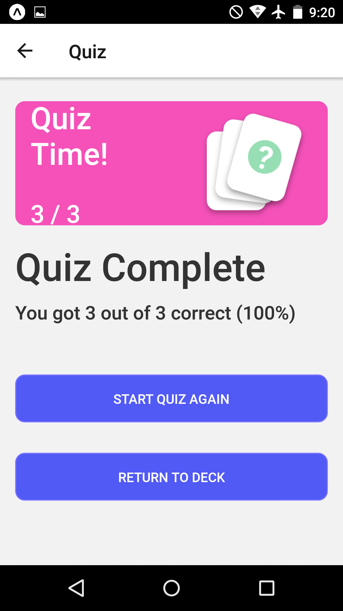

# Mobile-FlashCards-App

This is the Third project of Udacity nano degree. You could manage decks and cards in it to answer questions at any time with your phone.

# How To Run the Project Locally

use `Expo-cli` to run the app.

You can clone the App using the below link.

`git@github.com:naima-shk/Mobile-FlashCards-App.git`

In the project directory, you can run:

`npm install`

then run

`npm start`

# Device Testing

The App has been tested on the Android device only.

# Screenshots

